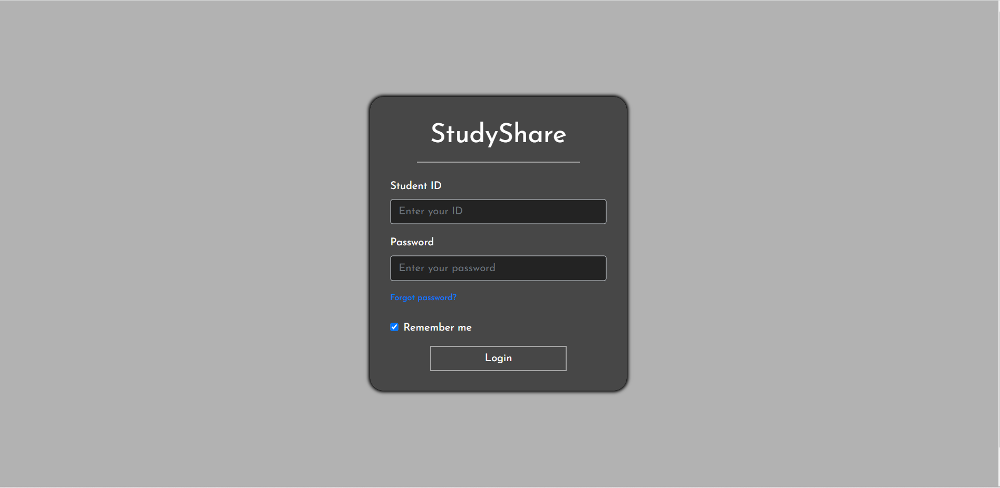
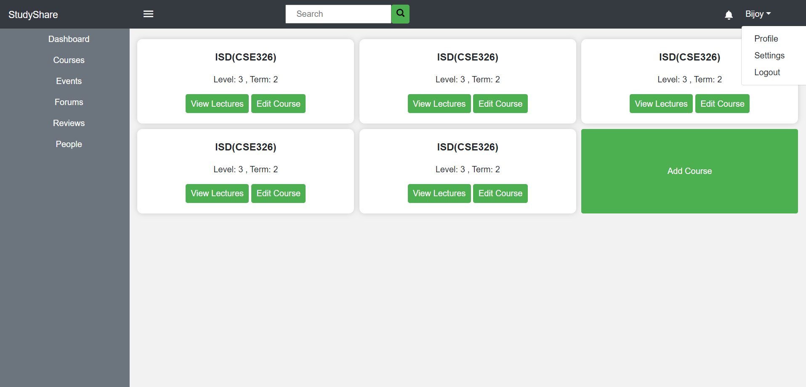
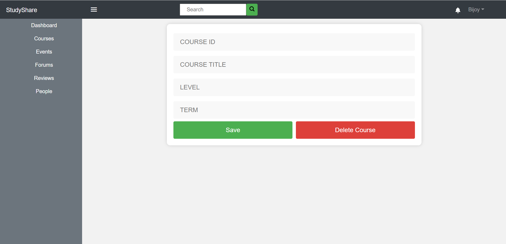
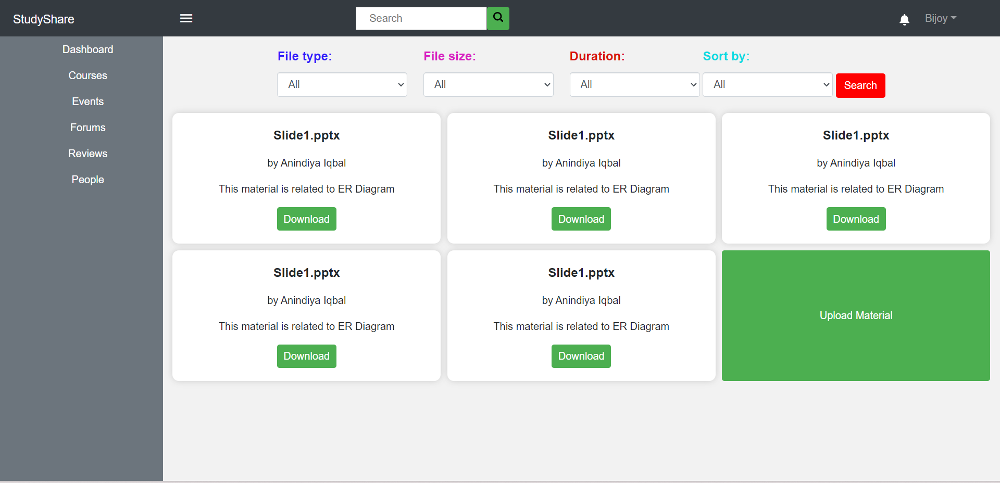
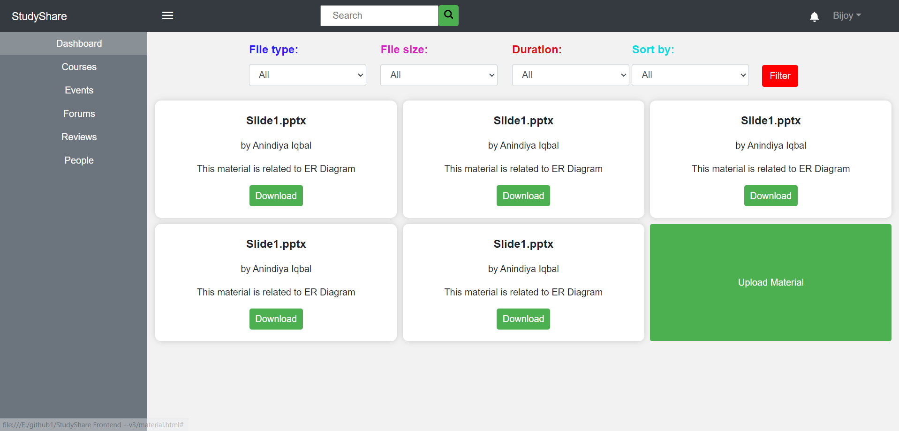
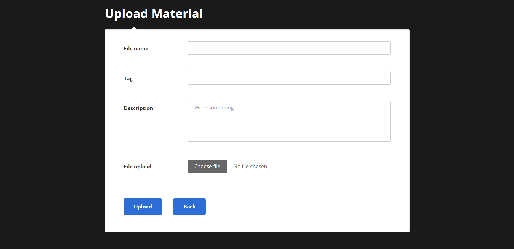
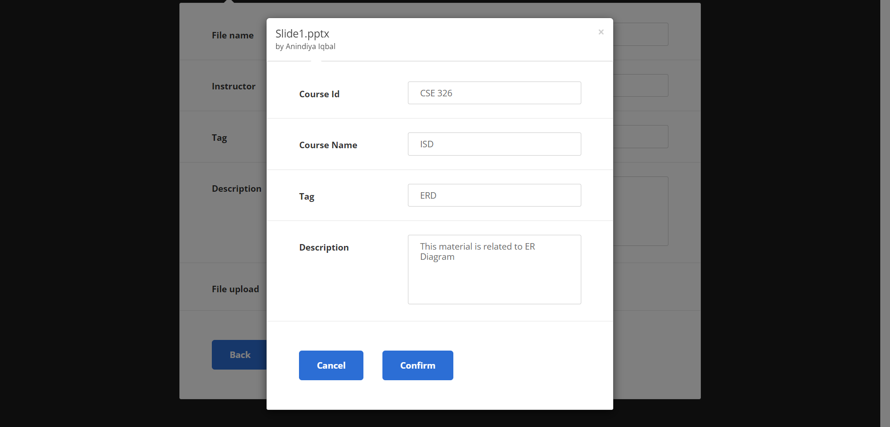
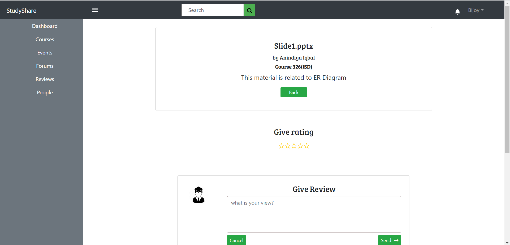
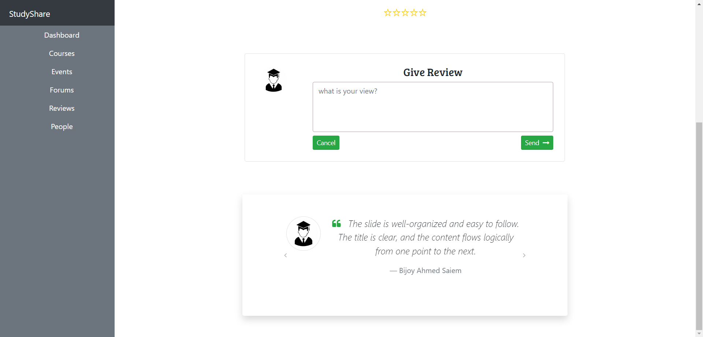
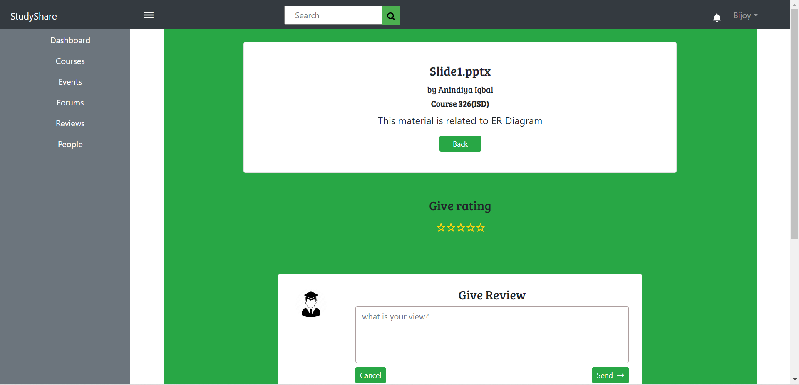

Youtube Link: https://youtu.be/25jL7FPmXTI
# StudyShare_Frontend
It is an implementation of one CSE326(ISD) project module.
The frontend is implemented using HTML, CSS, and Bootstrap. And the backend is implemented in Node.js. Supabase with PostgreSQL is used for database management.
Available page:
1. Login Page(To log in give any student id and any 8 character password)
2. Course Page ( including navbar, sidebar, dropdown, search menu, Add course form and edit course form )
3. Materials Page ( filter with dropdown menu, upload material and view material functionality )
4. Upload Material form ( necessary information with choose file option and Modal form ( click preview to see it)
5. View the Material/product page ( including the give rating option and give review option, and you can see the review given with the testimonial slider template in Bootstrap)

# Web pages of this project
>
>
>
>
>
>
>
>
>
>
>
>
>
>
>
>
>
>
>
>
>
