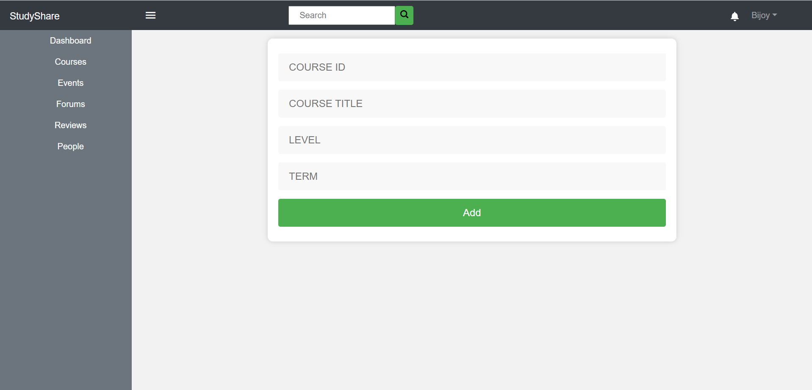

Youtube Link : https://youtu.be/25jL7FPmXTI
# StudyShare_Frontend
It is a implementation of one module of CSE326(ISD) project.
Frontend is implemented using bootstrap.
Availabe page:
1. Login Page(To log in give any student id and any 8 character password)
2. Course Page ( including navbar , sidebar , dropdown , search menu , Add course form and edit course form )
3. Materials Page ( filter with dropdown menu , upload material and view material functionality )
4. Upload Material form ( necessary information with choose file option and Modal form ( click preview to see it)
5. View Material/product page ( including give rating option , give review option , and you can see the review given with testimonial slider template in bootstrap)

# Web pages of this project
>
>
>
>
>
>
>
>
>
>
>
>
>
>
>
>
>
>
>
>
>
